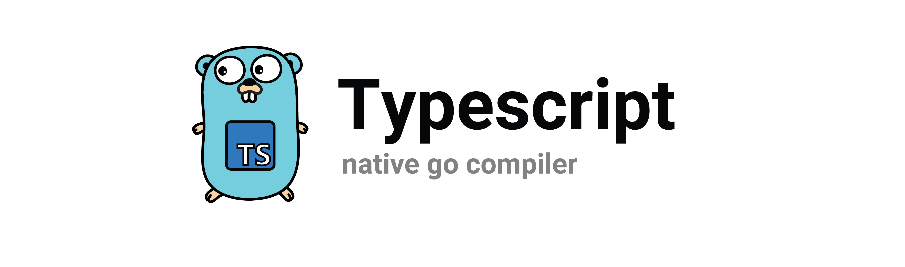

This package provides a thin wrapper around [goja](https://github.com/dop251/goja) (a native Javascript runtime for Go). There are no direct dependencies besides goja, and [testify](https://github.com/stretchr/testify) (for testing only). This package supports the following features:
* Typescript compilation and evaluation.
* A context-aware evaluation API to support cancellation.
* AMD-style modules using the built-in [Almond module loader](https://github.com/requirejs/almond).
* Custom Typescript version registration with built-in support for versions 3.8.3, 3.9.9, 4.1.2, 4.1.3, 4.1.4, 4.1.5, 4.2.2, 4.2.3, 4.2.4, and 4.7.2.
* 90%+ test coverage

## Installation

    go get github.com/clarkmcc/go-typescript

## Examples
* [Transpile Typescript](examples/typescript_test.go)
* [Transpile and Evaluate Typescript](examples/typescript_evaluate_test.go)
* [AMD Modules](examples/typescript_amd_modules_test.go)
* [Context Cancellation](examples/typescript_context_test.go)